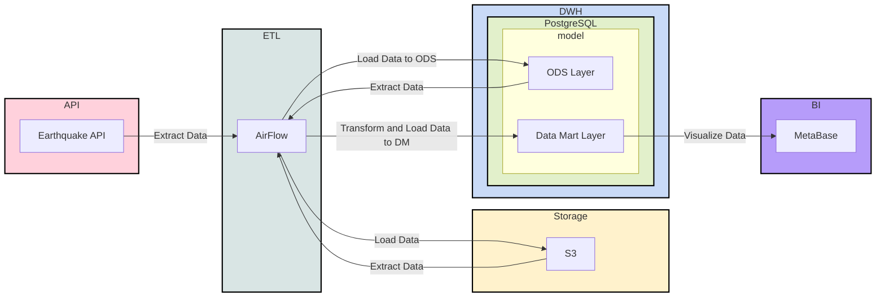

# de_proj_earthquake
pet project: earthquake data, Data Lake architecture

## Data Architecture

Lakehouse



## Environment Setup

To create and activate the conda environment:

```bash
conda create -n de_proj_earthquake python=3.12
conda activate de_proj_earthquake
```

using default docker-compose.yaml

To download the docker-compose.yaml file:

```bash
curl -o docker-compose.yaml https://airflow.apache.org/docs/apache-airflow/2.10.5/docker-compose.yaml
```

metabase:
https://www.metabase.com/docs/latest/installation-and-operation/running-metabase-on-docker


создаем файл .env c AIRFLOW UID и AIRFLOW_GID
touch .env
echo "AIRFLOW_UID=$(id -u)" >> .env && echo "AIRFLOW_GID=$(id -g)" >> .env
cat .env

Чтобы окружение правильно подсвечивало синтаксис добавим requirements.txt c apache-airflow==2.10.5 (хотя airflow работает в контейнере):
```
pip install -r requirements.txt
```

Нужно будет добавить docherfile для сборки airflow c duckdb

Разворачивание инфраструктуры:

docker-compose up -d


airflow доступен по: localhost:8080
user: airflow
password: airflow

Добавим variables через airflow-webserver (которые сохранили в cred.py):
access_key
secret_key

minio доступен по: http://localhost:9001/
user: minioadmin
password: minioadmin

Создайте bucket:
prod (Или какой хотите, но затем нужно поменять имя BUCKET в raw_from_api_to_s3.py)
Создайте и сохраните ключ в cred.py (для безопасности добавлен в .gitignore)


## Notes

SQL схемы:

```sql
CREATE SCHEMA IF NOT EXISTS ods;
CREATE SCHEMA IF NOT EXISTS dm;
CREATE SCHEMA IF NOT EXISTS stg;
```

DDL `ods.fct_earthquake`:
```sql
CREATE TABLE ods.fct_earthquake
(
	time varchar,
	latitude varchar,
	longitude varchar,
	depth varchar,
	mag varchar,
	mag_type varchar,
	nst varchar,
	gap varchar,
	dmin varchar,
	rms varchar,
	net varchar,
	id varchar,
	updated varchar,
	place varchar,
	type varchar,
	horizontal_error varchar,
	depth_error varchar,
	mag_error varchar,
	mag_nst varchar,
	status varchar,
	location_source varchar,
	mag_source varchar
)
```

DDL `dm.fct_count_day_earthquake`:

```sql
CREATE TABLE dm.fct_count_day_earthquake AS 
SELECT time::date AS date, count(*)
FROM ods.fct_earthquake
GROUP BY 1
```

DDL `dm.fct_avg_day_earthquake`:

```sql
CREATE TABLE dm.fct_avg_day_earthquake AS
SELECT time::date AS date, avg(mag::float)
FROM ods.fct_earthquake
GROUP BY 1 
```

## source video and repository:
https://www.youtube.com/watch?v=MQPHgUQvKnI&t=2s
https://github.com/k0rsakov/pet_project_earthquake/tree/main