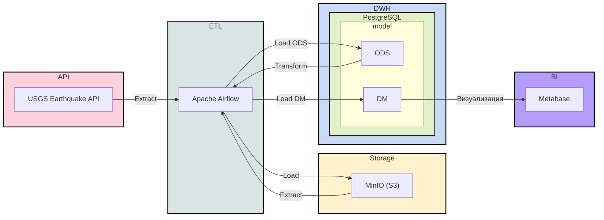

# Pet project: пайплайн данных о землетрясениях

**Личный учебный проект** по data engineering: собрать сквозной pipeline от API до витрин и дашборда, в духе lakehouse.

Что внутри: извлечение событий из [USGS FDSNWS Event API](https://earthquake.usgs.gov/fdsnws/event/1/), сырой слой в S3-совместимом MinIO (Parquet), загрузка в PostgreSQL (ODS), агрегаты в DM, визуализация в Metabase. Оркестрация — Apache Airflow 2.10. Это не боевой контур, а песочница для экспериментов и портфолио.

## Содержание

- [Архитектура](#архитектура)
- [Стек](#стек)
- [Требования](#требования)
- [Развёртывание](#развёртывание)
- [Конфигурация](#конфигурация)
- [DAG](#dag)
- [Модель данных](#модель-данных)
- [Безопасность и ограничения](#безопасность-и-ограничения)
- [Ссылки](#ссылки)

## Архитектура

Слои: **raw** (Parquet в объектном хранилище) → **ODS** (PostgreSQL) → **DM** (агрегаты по дням) → **BI** (Metabase).



## Стек

| Компонент   | Назначение |
|------------|------------|
| Apache Airflow 2.10 | Оркестрация DAG, CeleryExecutor |
| DuckDB | Обработка CSV/Parquet, выгрузка в S3 и PostgreSQL |
| MinIO | S3-совместимое объектное хранилище |
| PostgreSQL 13 | Метаданные Airflow, ODS/DWH |
| Metabase | BI-слой |

Базовый `docker-compose.yaml` взят из [шаблона Airflow для быстрого старта](https://airflow.apache.org/docs/apache-airflow/2.10.5/docker-compose.yaml) и дополнен сервисами `postgres_dwh`, `minio` и `metabase` под задачи этого pet-проекта.

## Требования

- Docker и Docker Compose v2
- (Опционально) Conda или Python 3.12 для IDE и подсветки DAG — см. `requirements.txt`

## Развёртывание

### 1. Идентификаторы пользователя для Airflow

В корне репозитория создайте `.env` (файл в `.gitignore`):

```bash
printf 'AIRFLOW_UID=%s\nAIRFLOW_GID=%s\n' "$(id -u)" "$(id -g)" > .env
```

Права на каталоги, которые монтируются в контейнер:

```bash
sudo chown -R 50000:0 logs dags data
```

Каталог `data/` используется MinIO.

### 2. Зависимости для локальной разработки IDE

```bash
conda create -n de_proj_earthquake python=3.12 -y
conda activate de_proj_earthquake
pip install -r requirements.txt
```

Airflow выполняется в контейнере; в `docker-compose.yaml` для контейнеров задано `_PIP_ADDITIONAL_REQUIREMENTS` (в т.ч. DuckDB) — так проще для pet-проекта; в реальном проде обычно [собирают свой образ](https://airflow.apache.org/docs/docker-stack/build.html) с зафиксированными зависимостями.

### 3. Запуск

```bash
docker compose up -d
```

### 4. Сервисы по умолчанию

| Сервис    | URL | Учётные данные (только для локальной среды) |
|-----------|-----|---------------------------------------------|
| Airflow UI | http://localhost:8080 | `airflow` / `airflow` |
| MinIO Console | http://localhost:9001 | `minioadmin` / `minioadmin` |
| Metabase | http://localhost:3000 | задаётся при первом входе в UI |

В MinIO создайте bucket с именем, совпадающим с константой `BUCKET` в DAG (по умолчанию `prod`). При смене имени обновите `BUCKET` в `dags/raw_from_api_to_s3.py` и при необходимости переменные окружения в DAG `raw_from_s3_to_pg`.

Также в MinIO нужны S3-учётные данные (пар `access key` / `secret key`) для доступа из DAG. Эти ключи используйте так:
- либо напрямую root-учётные данные MinIO (`minioadmin` / `minioadmin` из `docker-compose.yaml`),
- либо создайте в MinIO нового пользователя и сгенерируйте для него access/secret keys (и выдайте ему права на нужный bucket).

Далее задайте эти значения в Airflow Variables: `access_key` и `secret_key` (см. секцию ниже).

## Конфигурация

### Переменные Airflow (Admin → Variables)

| Ключ | Назначение |
|------|------------|
| `access_key` | Ключ доступа MinIO (S3) |
| `secret_key` | Секретный ключ MinIO |
| `pg_password` | Пароль пользователя PostgreSQL DWH (`postgres`) |

DAG `raw_from_s3_to_pg` дополнительно может читать `ACCESS_KEY`, `SECRET_KEY`, `BUCKET`, `PG_PASSWORD` из окружения (приоритет над Variables для ключей S3 при установке переменных в контейнере).

### Подключение к DWH из Airflow (опционально)

Для операторов, ожидающих Airflow Connection, можно завести подключение:

- `Connection Type`: `Postgres`
- `Connection ID`: `postgres_dwh`
- `Host`: `postgres_dwh` (имя сервиса из `docker-compose.yaml`)
- `Port`: `5432`
- `Database`: `postgres`
- `Login`: `postgres`
- `Password`: `postgres`

Сами DAG загрузки в PostgreSQL используют DuckDB с хостом `postgres_dwh` внутри Docker-сети.

## DAG

Все DAG по расписанию `0 5 * * *` (ежедневно в 05:00, часовой пояс задан в коде DAG).

| DAG ID | Описание |
|--------|----------|
| `raw_from_api_to_s3` | Загрузка сырых данных из USGS API в MinIO (Parquet, слой `raw`) |
| `raw_from_s3_to_pg` | Чтение Parquet из S3 и загрузка в `ods.fct_earthquake` |
| `fct_count_day_earthquake` | Витрина: число событий по дням |
| `fct_avg_day_earthquake` | Витрина: средняя магнитуда по дням |

После первого запуска включите DAG в UI и задайте Variables.

## Модель данных

Инициализация схем (выполните в PostgreSQL DWH при необходимости):

```sql
CREATE SCHEMA IF NOT EXISTS ods;
CREATE SCHEMA IF NOT EXISTS dm;
CREATE SCHEMA IF NOT EXISTS stg;
```

**ODS — факт землетрясений** (`ods.fct_earthquake`):

```sql
CREATE TABLE ods.fct_earthquake
(
    time varchar,
    latitude varchar,
    longitude varchar,
    depth varchar,
    mag varchar,
    mag_type varchar,
    nst varchar,
    gap varchar,
    dmin varchar,
    rms varchar,
    net varchar,
    id varchar,
    updated varchar,
    place varchar,
    type varchar,
    horizontal_error varchar,
    depth_error varchar,
    mag_error varchar,
    mag_nst varchar,
    status varchar,
    location_source varchar,
    mag_source varchar
);
```

**DM — витрины** (пример определения; фактическая логика может повторяться в DAG):

```sql
CREATE TABLE dm.fct_count_day_earthquake AS
SELECT time::date AS date, count(*)
FROM ods.fct_earthquake
GROUP BY 1;

CREATE TABLE dm.fct_avg_day_earthquake AS
SELECT time::date AS date, avg(mag::float)
FROM ods.fct_earthquake
GROUP BY 1;
```

## Безопасность и ограничения

Проект рассчитан на **локальную машину или изолированную среду**: дефолтные логины (`airflow`, `minioadmin`, `postgres`) удобны для разработки, но для чего-либо публичного их нужно менять. Секреты не кладите в git — только Airflow Variables, `.env` (вне репозитория) или аналог.

Официальный docker-compose Airflow прямо указывает, что это конфиг для **разработки/пробы**, а не готовый прод. Для настоящего продакшена понадобятся отдельный деплой, секреты, бэкапы, мониторинг и т.д.; здесь этого намеренно нет — это pet project.

## Ссылки

- Видео-разбор идеи пайплайна: [YouTube](https://www.youtube.com/watch?v=MQPHgUQvKnI&t=2s)
- Репозиторий-референс: [github.com/k0rsakov/pet_project_earthquake](https://github.com/k0rsakov/pet_project_earthquake/tree/main)
- [Metabase: Docker](https://www.metabase.com/docs/latest/installation-and-operation/running-metabase-on-docker)
